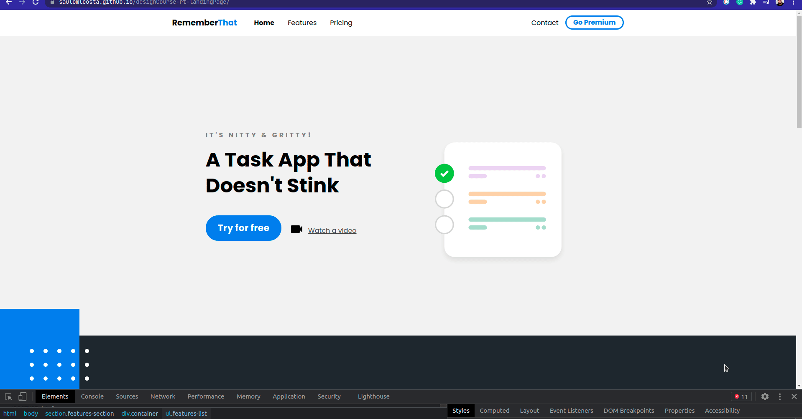

<h1 align="center">
    
</h1>

<h1>
    
</h1>

<h3 align="center">
    <a href="https://saulomlcosta.github.io/designCourse-rt-landingPage/">Acessar a demonstração</a>
<h3 >

# Índice
- [Sobre](#-sobre)
- [Tecnologias Utilizadas](#-tecnologias-utilizadas)

---

## 🔖&nbsp; Sobre

O projeto **rememberThat** é uma página de aterrissagem criada através do canal **DesignCourse** utilizando métodos responsivos para criar um ambiente amigável e apresentável em todo e qualquer dispositivo.

---

## 🚀 Tecnologias utilizadas

O projeto foi desenvolvido utilizando as seguintes tecnologias

- [HTML](https://developer.mozilla.org/en-US/docs/Web/HTML)
- [SCSS](https://sass-lang.com/documentation)
    
---
Desenvolvido ❤️ Saulo Costa
